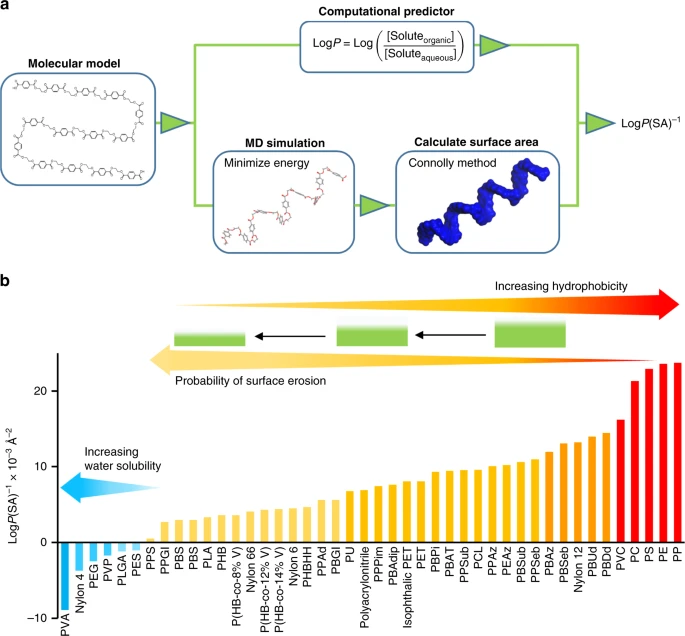

## MOESM5_ESMデータセット
MOESM5_ESM data setは、ペンシルバニア州立大学Robert T. Mathers教授らの論文[1]で公開されている文献のSupplementary informationにある海洋性生分解性ポリマーのデータセット（41467_2020_14538_MOESM5_ESM.xlsx）です。ポリマーの種類、形状、物性、および分解実験データがまとめられています。

### ポリマーの種類
ポリマーの種類としては、直鎖、分岐、環状の構造を持つポリエステル、ポリアセタール、ポリアクリルアミド、PC、ポリエーテル、PE、PP、ポリシロキサン、PS、PU、PVCを含む110種類以上のポリマーが含まれています。また、データセットに含まれるプラスチックは、市販のサンプルと実験室で作られたものです。

### 分類
これらはクラス（ポリマーのタイプ）、試料（フィルム、パウダー）、物理的属性（質量、体積、表面対体積比）、実験パラメーター（海水中での時間、温度）によって分類されています。

### 生分解性条件
海水にさらされた際の重量減少や、生物学的・生物学的条件も記録されています。
さらに、分子レベルの記述子とバルクポリマー記述子によって、各ポリマーを区別しており、バルク特性記述子には、密度、重量平均分子量(Mw)、数平均分子量(Mn)、分散度(Mw/Mn)、Tg、融解温度(Tm)、結晶化度、融解エンタルピー(すなわち、必要なエネルギー量(J g-1))が含まれています。

### 記述子
分子レベルの記述子には、ハイブリダイゼーション（sp3、sp2）の概念を用いた炭素、酸素、窒素原子の種類と、ポリマー中のこれらの原子の割合が含まれています。分子レベルの構造的特徴を捉えるために、データベースはモノマーあたりの水素の数、モノマーあたりのCH3、CH2、CH基の数、環状環の数、環状環に含まれる原子の割合が示されています。

また、各ポリマーの油状または撥水性を連続的に定量化するために、疎水性と呼ばれる概念を検討されています。

---
[1] Kyungjun Min, Joseph D. Cuiffi & Robert T. Mathers　"Ranking environmental degradation trends of plastic marine debris based on physical properties　and molecular structure", NATURE COMMUNICATIONS. 11, Article number: 727 (2020) https://www.nature.com/articles/s41467-020-14538-z

---

【MOESM5_ESM変数一覧（特徴量）】

【性状/物理的記述子】
1. Number  	
1. Name  
1. shape  
1. thickness (cm)  	
1. L (cm)  
1. W (cm)  
1. SA (cm2)  
1. Vol (cm3)  
1. den (g mL-1)  
1. mass (g)  
1. SA/V (cm-1) 

【分子記述子】
1. total C in comonomer A  
1. total C in comonomer B  
1. % comonomer B  
1. CH in comonomer A  
1. CH in A+B  
1. CH2 in A  
1. CH2 in A+B  
1. CH3 in A+B  
1. total CH bonds A+B  
1. total N in A+B  
1. total O in A+B  
1. total C=O  
1. % C=O  
1. total sp3 C  
1. %sp3 C  
1. #rings  
1. %C in rings

【物性記述子】
1. LogP(SA)-1 (Å-2)  
1. Mw (kg mol-1)  
1. Mn (kg mol-1)  
1. Mw/Mn  
1. Tg (°C)  
1. Tm (°C)  
1. % cryst  
1. enthalpy (J g-1)  
1. (Tw-Tg)/(LogP/SA)  
1. Temp (°C)  
1. degrad. time (days)  
1. BOD (% day-1)  
1. wt. loss (% month-1)  
1. wt. loss (% day-1)  
1. wt. loss (mg cm-2 day-1)  
1. medium  
1. abiotic or biotic conditions  
1. 5 tier rank  
1. 3-tier rank  
